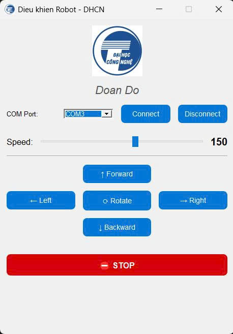

# Bluetooth-Controlled Dual Motor System for Lawn Mower Robot

This project is part of a larger initiative to develop a smart autonomous lawn mower robot. The purpose of this module is to enable **Bluetooth-based control of two high-power DC motors**, allowing the user to navigate the robot remotely using a custom-designed GUI application.

## 🛠️ Hardware Components

| Component                     | Purpose                                                       |
|------------------------------|---------------------------------------------------------------|
| Arduino Uno R3               | Main microcontroller for interpreting commands                |
| 2 × BTS7960 Motor Driver     | High-power drivers to control each DC motor independently     |
| 2 × DC Motors (24V, 200W)    | Provide propulsion to the lawn mower robot                    |
| HC-05 Bluetooth Module       | Wireless UART communication between PC and Arduino            |
| LM2596 Buck Converter        | Converts 24V battery power to 9V for Arduino                  |
| 2 × 12V 4Ah Batteries        | Connected in series to supply a 24V power source              |

---

## 💻 Software Stack

- **Arduino IDE** – Firmware development and upload
- **Python 3** – Application layer for motor control
- **PyQt5** – Graphical User Interface framework
- **pyserial** – Serial communication between PC and Arduino

---

## 🧠 Features

- Bluetooth-based motor control using HC-05 module
- GUI with buttons for:
  - Forward, Backward, Left, Right, Rotate, and Stop
- Adjustable PWM speed control via slider
- COM port detection, connect/disconnect handling
- Real-time command sending to Arduino

---

## 🖼️ GUI Interface

<p align="center">
  
</p>

---

## 🔌 Hardware Setup

<p align="center">
  
</p>

---

## 📁 Project Structure
```
MotorControl_LawnMower/
│
├── Video_Test.mp4
│
├── Docs/
│   └── Report.docx
│
├── Main/
│   ├── Arduino_Code/
│   │   └── control_2motor_high_power.ino
│   │
│   └── GUI_APP/
│       ├── interface.jpg
│       ├── logo.png
│       ├── Motor_controller.exe
│       ├── Motor_controller.py
│       └── Motor_controller.spec
│
├── Schematic/
│   ├── Motor_driver.pdf
│   └── Real.jpg
│
├── README.md
└── .gitignore

## 🚀 Getting Started

1. Upload the Arduino code from `Arduino_Code/motor_control.ino` to your Arduino Uno.
2. Connect the HC-05 module to Arduino using the pins specified in the code.
3. Run the GUI application:
   ```bash
   pip install pyqt5 pyserial
   python GUI_App/main.py
   ```
4. Select the correct COM port and connect.


## 👨‍💻 Authors
- Doan Do
## 📝 License
The project is used for learning - research.
